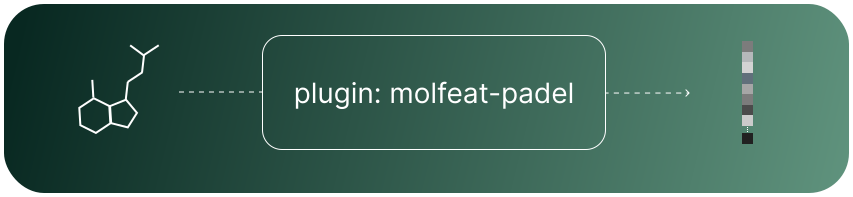

# 🧩 `molfeat-PaDEL`

A molfeat plugin that adds support for PaDEL-Descriptors

---
<div align="center">
    
</div>

<p align="center">
    <b> 🧩 molfeat-PaDEL - A molfeat plugin that adds support for PaDEL-Descriptors </b> <br />
</p>
<p align="center">
  <a href="https://molfeat-docs.datamol.io/stable/developers/create-plugin.html#2-explicitly-load-registered-plugins-to-automatically-discover-padeldescriptors" target="_blank">
      Docs
  </a> | 
  <a href="https://molfeat.datamol.io/" target="_blank">
      Homepage
  </a>
</p>

---

[](https://pypi.org/project/molfeat-padel/)
[](https://pypi.org/project/molfeat-padel/)
[](https://pypi.org/project/molfeat-padel/)
[](https://github.com/datamol-io/molfeat-padel/blob/main/LICENSE)
[](https://github.com/datamol-io/molfeat-padel/actions/workflows/test.yml)
[](https://github.com/datamol-io/molfeat-padel/actions/workflows/code-check.yml)
[](https://github.com/datamol-io/molfeat-padel/actions/workflows/release.yml)

## Overview

`molfeat-padel` is an extension to `molfeat` that adds support for PaDEL descriptors. The PaDEL descriptors are a mix of  molecular descriptors (663 1D, 2D descriptors, 134 3D descriptors) and structural fingerprints based on the Chemistry Development Kit (CDK). 

- To learn more about PaDEL descriptors, please refer to the following paper: [Yap, 2010](https://doi.org/10.1002/jcc.21707)

- To learn more about [`molfeat`](https://github.com/datamol-io/molfeat), please visit https://molfeat.datamol.io/. 

- To learn more about the plugin system of molfeat, please see [extending molfeat](https://molfeat-docs.datamol.io/stable/developers/create-plugin.html)

## Installation

You can install `molfeat-padel` with:

```bash
mamba install -c conda-forge molfeat
```
or 

```bash
pip install molfeat-padel
```

`molfeat-padel` depends on [molfeat](https://github.com/datamol-io/molfeat) and [padelpy](https://github.com/ecrl/padelpy)

## Usage

The following example shows how to use the `molfeat-padel` plugin package automatically when installed. All scenarios highlighted in this example are valid:


1. initializing the calculator from the plugin package

```python

from molfeat.trans import MoleculeTransformer

from molfeat_padel.calc import PadelDescriptors
mol_transf = MoleculeTransformer(featurizer=PadelDescriptors())
```

2. auto registration of PadelDescriptors to the list of calculators

```python
from molfeat.trans import MoleculeTransformer
import molfeat_padel

mol_transf = MoleculeTransformer(featurizer="PadelDescriptors")
# works because PadelDescriptors is imported in the root init of molfeat_padel
```

3. enable autodiscovery and addition of the `PadelDescriptors` as importable attribute to the entry point group `molfeat.calc`

```python
# put this somewhere in you code
from molfeat.trans import MoleculeTransformer
from molfeat.plugins import load_registered_plugins
load_registered_plugins(add_submodules=True)
```

```python
# this is now possible
from molfeat.calc import PadelDescriptors
mol_transf = MoleculeTransformer(featurizer=PadelDescriptors())
```

```python
# this is also possible
mol_transf = MoleculeTransformer(featurizer="PadelDescriptors")
```

### Dependencies

The only dependencies of `molfeat-padel` are `padelpy` and `molfeat`

## Changelog
See the latest changelogs at [CHANGELOG.rst](./CHANGELOG.rst).

## Maintainers

- @maclandrol

## License

Under the Apache-2.0 license. See [LICENSE](LICENSE).
